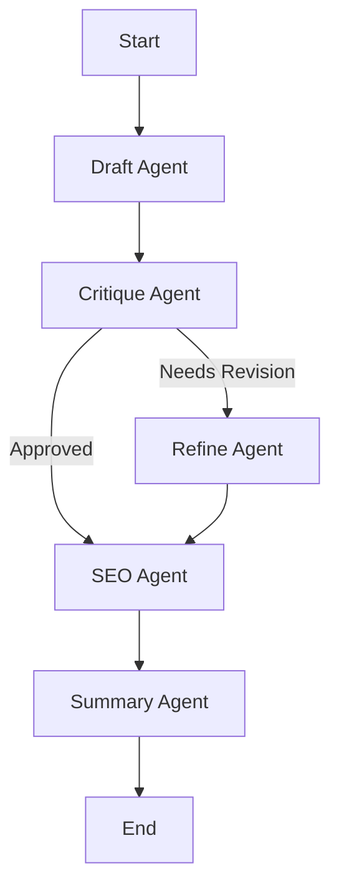

# AI Assistant with Practical Tools

## Overview
This project is an **AI Assistant** built using **LangGraph** that provides practical, real-world tools to help users with everyday tasks. The assistant can answer questions about weather, stocks, news, recipes, calculations, travel planning, health advice, and more.

The workflow consists of 5 specialized AI agents working in sequence:
1.  **Draft Agent**: Generates the initial response based on your query.
2.  **Critique Agent**: Reviews the response for quality and completeness.
3.  **Refine Agent**: Improves the response if the critique agent requests revisions.
4.  **SEO Agent**: Extracts top keywords from the final response.
5.  **Summary Agent**: Generates a concise summary.

## Features
*   **10 Practical Tools**: Real-world utilities for everyday needs
*   **Multi-Agent Workflow**: Specialized nodes for drafting, critiquing, refining, and optimizing
*   **Conditional Logic**: The workflow automatically decides whether to refine responses
*   **Execution Tracking**: Real-time logs show which agent is working and how long each step takes
*   **Memory**: Uses SQLite to maintain conversation state and context

## Available Tools

### 🌤️ Weather Information
- Get current weather for major cities worldwide
- Example: "What's the weather like in Tokyo?"

### 📈 Stock Prices
- Real-time stock price lookups
- Example: "What's Apple's stock price?"

### 📰 News Headlines
- Latest news in technology, business, sports, etc.
- Example: "Show me technology news"

### 👨‍🍳 Recipe Suggestions
- Recipe ideas based on available ingredients
- Example: "What can I make with chicken and rice?"

### 🔢 Math Calculator
- Calculate mathematical expressions
- Example: "Calculate 15 * 23 + sqrt(16)"

### 📏 Unit Converter
- Convert between different units (weight, temperature, distance, volume)
- Example: "Convert 5 kg to pounds"

### 🕐 Time Zone Converter
- Get current time in different timezones
- Example: "What time is it in Tokyo?"

### 🏥 Health Advice
- General wellness tips for common symptoms
- Example: "What helps with headaches?"

### ✈️ Travel Planner
- Basic travel itineraries for popular destinations
- Example: "Plan a 5-day trip to Paris"

### 📝 Reminder Manager
- Add, list, complete, and remove tasks
- Example: "Add a reminder to buy groceries"

## Installation

1.  **Clone the repository:**
    ```bash
    git clone <repository-url>
    cd langgraph-separate-folder-structure
    ```

2.  **Create and activate a virtual environment:**
    ```bash
    python3 -m venv .venv
    source .venv/bin/activate
    ```

3.  **Install dependencies:**
    ```bash
    pip install -r requirements.txt
    pip install langgraph-checkpoint-sqlite
    ```

4.  **Set up environment variables:**
    Create a `.env` file in the root directory and add your API keys:
    ```env
    GOOGLE_API_KEY=your_google_api_key_here
    ```

## Usage

Run the main application:

```bash
python3 main.py
```

**Example Conversations:**
*   "What's the weather like in New York?"
*   "What's Apple's stock price today?"
*   "Show me the latest technology news"
*   "What can I cook with chicken, rice, and vegetables?"
*   "Calculate 25 * 15 + sqrt(144)"
*   "Convert 10 kg to pounds"
*   "What time is it in Tokyo right now?"
*   "What helps with stress and anxiety?"
*   "Plan a 3-day trip to Paris"
*   "Add a reminder to call mom tomorrow"

## Project Design Tool

This application now includes a **Project Design Assistant** that helps you create your own LangGraph projects. Use the `design_langgraph_project` tool to get guided assistance in turning your ideas into structured workflows.

**How to use:**
1. Ask the bot: "Help me design a LangGraph project for [your idea]"
2. The assistant will guide you through:
   - Defining workflow steps
   - Identifying decision points
   - Planning memory requirements
   - Designing error handling

**Example:** "Help me design a LangGraph project for automating my daily news summary"

The design template is stored in `project_prompt_template.json` and includes:
- Personal use case exploration questions
- Workflow mapping guidance
- A complete stock price lookup example
- Tool creation patterns

## Project Structure

*   `main.py`: The entry point of the application. Handles user input and displays output.
*   `graph_builder.py`: Defines the LangGraph workflow, nodes, and edges.
*   `tools.py`: Contains 10 practical tools for real-world tasks (weather, stocks, news, recipes, calculations, etc.).
*   `config.py`: Configuration settings (e.g., model name).
*   `requirements.txt`: List of Python dependencies.

## Workflow Diagram


in-google-genai` (for Google GenAI LLM integration)
  * Optional: `openai` if using OpenAI LLMs

---

## Notes

* This project focuses on demonstrating **workflow flexibility, modularity, and human-AI collaboration**.
* Small datasets and lightweight LLMs are recommended for testing and demonstration.


