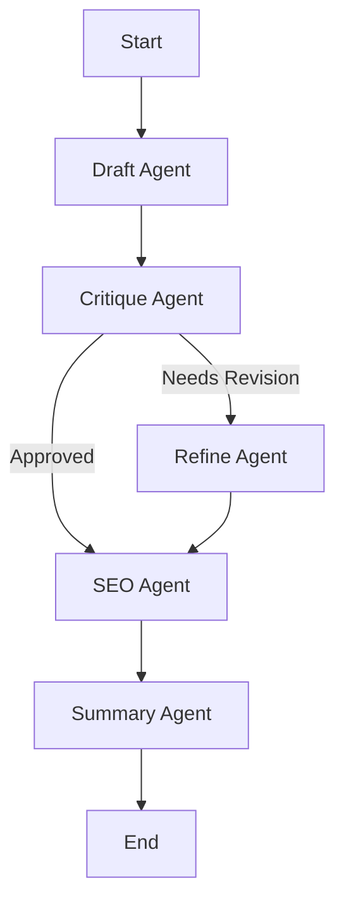

# AI Content Publishing Assistant

## Overview
This project is an **AI Content Publishing Assistant** built using **LangGraph**. It automates the entire content creation pipeline, from drafting to SEO optimization.

The workflow consists of 5 specialized AI agents working in sequence:
1.  **Draft Agent**: Generates the initial content based on your prompt.
2.  **Critique Agent**: Reviews the content for quality, length, and detail.
3.  **Refine Agent**: Improves the content if the critique agent requests revisions.
4.  **SEO Agent**: Extracts top SEO keywords from the final article.
5.  **Summary Agent**: Generates a concise meta description.

## Features
*   **Multi-Agent Workflow**: Specialized nodes for drafting, critiquing, refining, and optimizing.
*   **Conditional Logic**: The workflow automatically decides whether to refine content or proceed based on quality checks.
*   **Execution Tracking**: Real-time logs show which agent is working and how long each step takes.
*   **Memory**: Uses SQLite to maintain conversation state and context.

## Installation

1.  **Clone the repository:**
    ```bash
    git clone <repository-url>
    cd langgraph-separate-folder-structure
    ```

2.  **Create and activate a virtual environment:**
    ```bash
    python3 -m venv .venv
    source .venv/bin/activate
    ```

3.  **Install dependencies:**
    ```bash
    pip install -r requirements.txt
    pip install langgraph-checkpoint-sqlite
    ```

4.  **Set up environment variables:**
    Create a `.env` file in the root directory and add your API keys:
    ```env
    GOOGLE_API_KEY=your_google_api_key_here
    ```

## Usage

Run the main application:

```bash
python3 main.py
```

**Example Prompts:**
*   "Write a blog post about the benefits of meditation."
*   "Explain quantum computing to a beginner."
*   "Create a travel guide for Tokyo."

## Project Structure

*   `main.py`: The entry point of the application. Handles user input and displays output.
*   `graph_builder.py`: Defines the LangGraph workflow, nodes, and edges.
*   `tools.py`: Contains any external tools used by the agents.
*   `config.py`: Configuration settings (e.g., model name).
*   `requirements.txt`: List of Python dependencies.

## Workflow Diagram


in-google-genai` (for Google GenAI LLM integration)
  * Optional: `openai` if using OpenAI LLMs

---

## Notes

* This project focuses on demonstrating **workflow flexibility, modularity, and human-AI collaboration**.
* Small datasets and lightweight LLMs are recommended for testing and demonstration.


